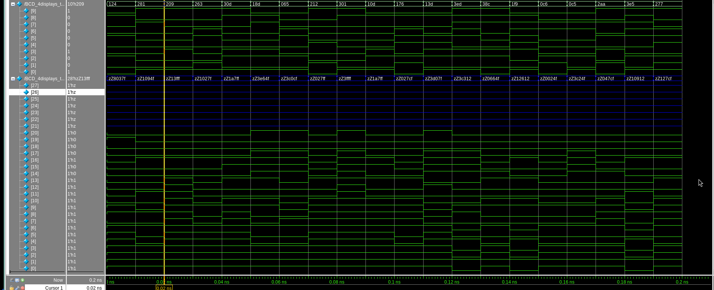
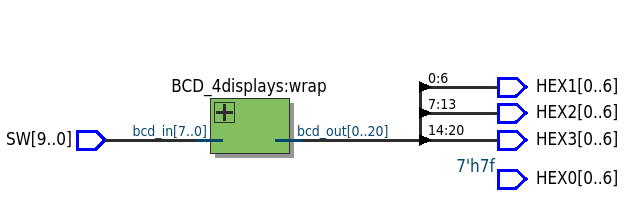
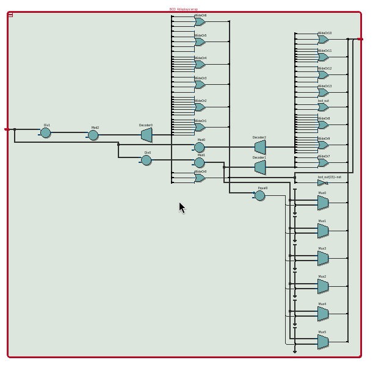

# BCD_4Displays

Este modulo permite mostrar numeros enteros por medio de las displays de 7 segmentos incluidas en la FPGA.

## Funcionalidad
- **Impresion de datos:** Separa por unidades, decenas y centenas.
- **Versatilidad:** Pertmite modificar de cuantos bits sera el valor de entrada y la cantidad de displays que se utilizaran.

## Verificación (Testbench)
El proyecto incluye un banco de pruebas (`BCD_4displays_tb.vcd`) diseñado para simular:
1. Distintos datos de entrada.

## Pruebas fisicas

## RTL

