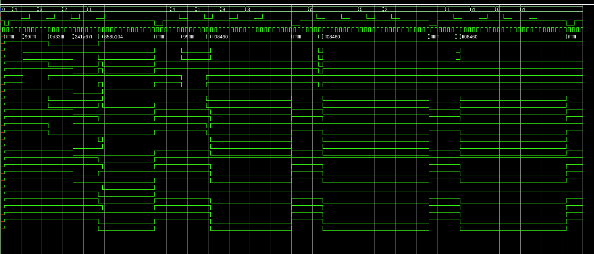
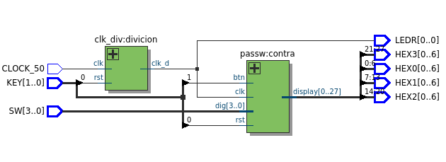
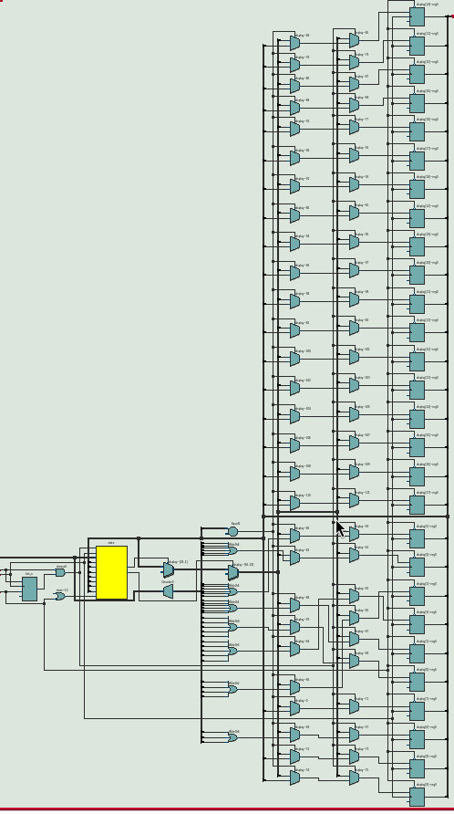
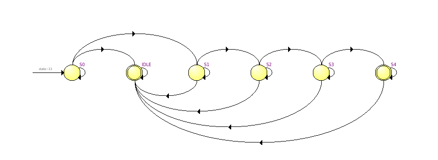

# FPGA Hardware Password Validator

Un sistema de validación de contraseñas de 4 dígitos implementado totalmente en hardware (Verilog) para la placa **DE10-Lite Standard**.

## Funcionalidad
- **Validación por Estados:** Implementación de una Máquina de Estados de Moore para la secuencia de entrada.
- **Interfaz Visual:** Salida a 4 displays de 7 segmentos con codificación Hexadecimal-a-7Seg personalizada.
- **Seguridad:** Bloqueo de sistema y reinicio por hardware mediante `rst`.

## Verificación (Testbench)
El proyecto incluye un banco de pruebas (`passw_tb.vcd`) diseñado para simular:
1. Entrada de contraseña correcta.
2. Manejo de errores en la secuencia.
3. Comportamiento ante ruidos en el botón de ingreso (`btn`).

## RTL

## Maquina de estados

