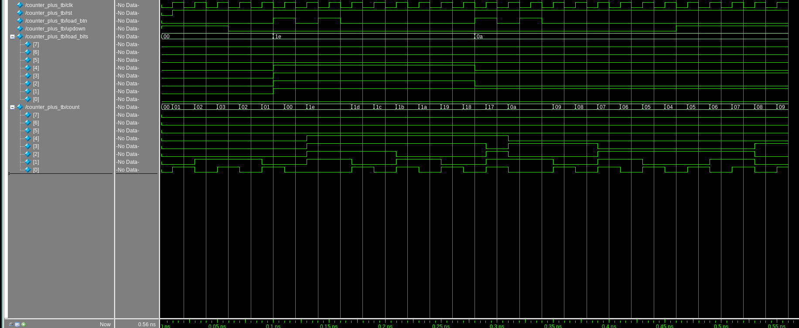
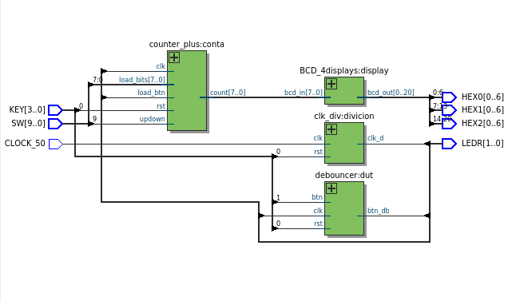
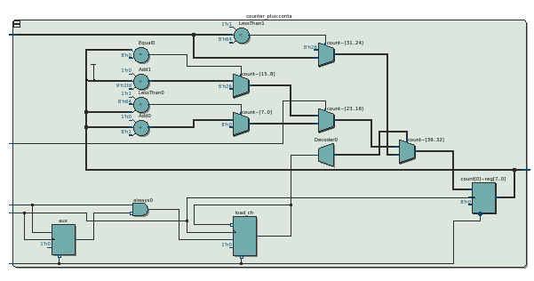

# Contador Plus

Este modulo permite contar de forma ascendente y descendente segun lo requiera el usuario, a su vez permite contar desde un valor de entrada, este valor se asigna cuando el usuario presiona el boton `load`.

## Funcionalidad
- **Impresion del conteo:** Separa imprime en que numero va el contador, cuando se preciona `load` se muestra que valor se asignara, cuando se vuelve a presionar se inicia el contador desde este punto.
- **Versatilidad:** Pertmite al usuario escojer si sera de forma ascendente o descendente con un `switch`.

## Verificación (Testbench)
El proyecto incluye un banco de pruebas (`counter_plus_tb.vcd`) diseñado para simular:
1. Distintos datos de entrada, conteo ascendente o descendente.

## Pruebas fisicas
Video en la carpeta `images`

## RTL

