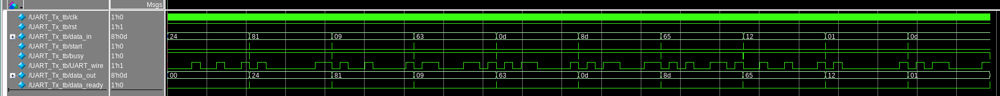
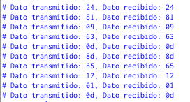
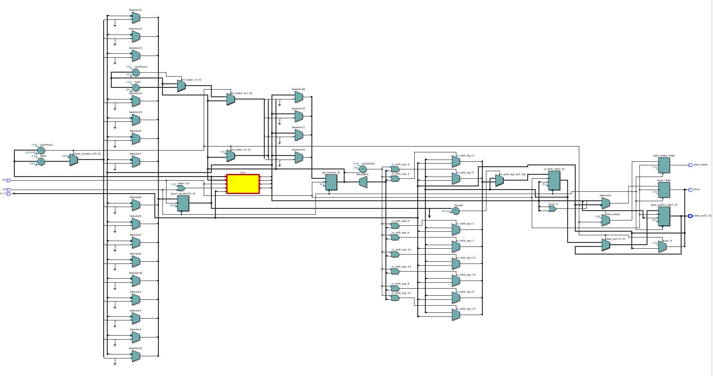
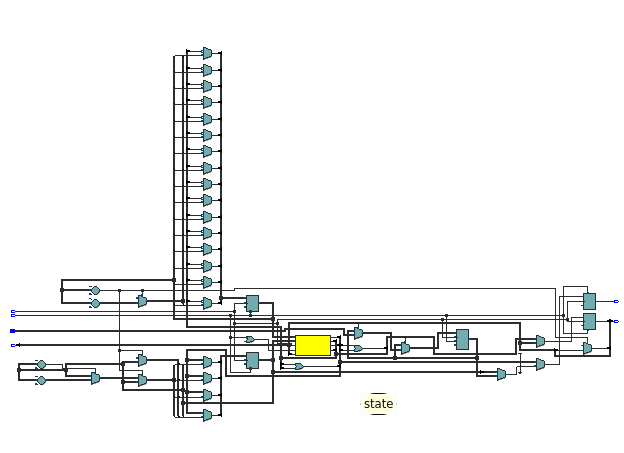

# Contador Plus

Este modulo permite enviar datos a otra placa por medio del protocolo serail UART cuando el usuario presiona el boton `start`.

## Funcionalidad
- **Impresion del dato:** El transmisor imprime en que numero va a enviar, cuando se preciona `start` se muestra que valor se recibio en la placa receptora.

## Verificación (Testbench)
El proyecto incluye un banco de pruebas (`UART_tx_tb.vcd`) diseñado para simular:
1. Distintos datos de envio y si la otra placa los recibe de forma correcta.

## Pruebas fisicas
Video en la carpeta `images`

## RTL RX

## RTL TX

